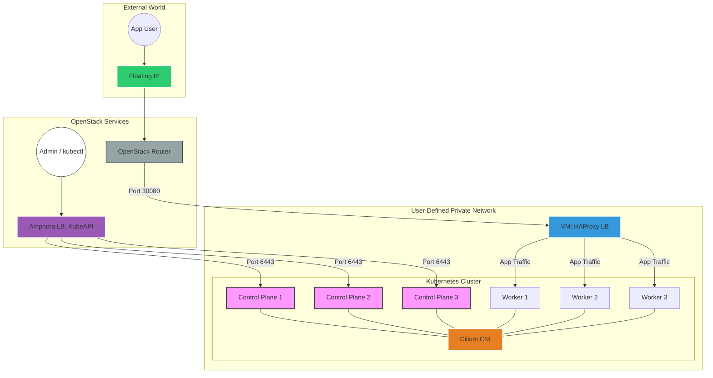

# HA Kubernetes Cluster on OpenStack

This project automates the deployment of a specific **High Availability (HA) Kubernetes Cluster** on OpenStack using **Terraform** for infrastructure and **Ansible** for configuration.

## Cluster Architecture



## 🚀 Features

*   **Kubernetes v1.35** (Latest Stable)
*   **High Availability**: 3 Control Plane Nodes + 3 Worker Nodes
*   **Networking**:
    *   **CNI**: Cilium (VXLAN mode, Hubble enabled)
    *   **Ingress**: Gateway API v1.4.1 (Standard Install)
*   **OS**: Ubuntu 24.04 LTS
*   **Security**:
    *   Dynamic Security Groups (Control Plane, Worker, Common)
    *   Strict firewall rules (SSH allowed only via jump host or VPN if configured)
    *   Swap disabled
    *   Kernel hardening (sysctl params)

## 📋 Prerequisites

*   **Terraform** (>= v1.5.0)
*   **Ansible** (>= 2.10)
*   **Secrets Configuration**: Ensure you have set up the `secrets/` directory according to the [Secrets README](secrets/README.md). This setup requires:
    *   `clouds.yaml` (OpenStack application credentials)
    *   `private_key.pem` (SSH private key)

##  Directory Structure

```plaintext
├── initInfra/              # Terraform Configuration
│   ├── terraform.tfvars    # Environment variables configuration
│   ├── main.tf             # Resource definitions (Instances, Security Groups)
│   ├── variables.tf        # Cluster size/naming variables
│   └── providers.tf        # OpenStack provider config
├── ansible/                # Ansible Playbooks & Inventory
│   ├── inventory_*.ini     # Generated dynamically by Terraform (DO NOT EDIT MANUALLY)
│   ├── playbook_common.yaml            # Base setup (Hostnames, Dependencies, K8s binaries)
│   ├── playbook_controlplane_init.yaml # Bootstrap the first node
│   ├── playbook_controlplane_join.yaml # Join additional control planes
│   ├── playbook_worker_join.yaml       # Join worker nodes
│   └── playbook_lb.yaml                # HAProxy load balancer setup
└── BuildAndTest.sh         # Automation script for Terraform & Ansible deployment
```

## 🛠 Usage

### 1. Infrastructure Provisioning

Navigate to the Terraform directory:

```bash
cd initInfra
terraform init
terraform apply
```

> **Note**: This will provision 7 VMs (3 Control Plane, 3 Worker, 1 HAProxy LB), create Security Groups, and generate Ansible inventory files dynamically.

---

### 2. Cluster Configuration

The easiest way to deploy the cluster is using the provided automation script:

```bash
bash BuildAndTest.sh
```

#### 📖 Manual Cluster Setup Guide (Interactive Learning Tutorials)

If you want to learn how the Kubernetes cluster is built from scratch by running Linux, container runtime, and `kubeadm` commands by hand, check out our step-by-step manual setup documentation:
- **[Manual Cluster Setup Overview & Roadmap](docs/manual-setup/README.md)**

#### Manual Ansible Playbook Execution

If you prefer to run the Ansible playbooks manually, navigate to the `ansible/` directory and execute them in order:

**Step 1: Base Configuration (All Nodes)**
Sets hostnames, installs containerd, kubeadm, kubelet, and dependencies.
```bash
ansible-playbook -i inventory_all.ini playbook_common.yaml
```

**Step 2: HAProxy Load Balancer**
Configures the dedicated VM to route traffic to the control plane.
```bash
ansible-playbook -i inventory_all.ini playbook_lb.yaml
```

**Step 3: Bootstrap Control Plane**
Initializes the first control plane node, installs Cilium & Gateway API.
```bash
ansible-playbook -i inventory_controlplane_init.ini playbook_controlplane_init.yaml
```

**Step 4: Join Control Planes**
Joins the remaining 2 control plane nodes to form the HA cluster.
```bash
ansible-playbook -i inventory_controlplane_join.ini playbook_controlplane_join.yaml
```

**Step 5: Join Workers**
Joins the 3 worker nodes to the cluster.
```bash
ansible-playbook -i inventory_workers.ini playbook_worker_join.yaml
```

---

## ✅ Verification

Once completed, you can verify the cluster status using the fetched kubeconfig, which is automatically saved to the central `kubeconfigs/` directory:

```bash
export KUBECONFIG=kubeconfigs/stfc-cloud.kubeconfig
kubectl get nodes -o wide
```

All 6 Kubernetes nodes should be in the `Ready` state.

## 🐛 Troubleshooting

**"Connection Refused"**:
- Ensure you are using the correct kubeconfig (`export KUBECONFIG=kubeconfigs/stfc-cloud.kubeconfig`).
- Verify the Control Plane Endpoint IP (HAProxy Load Balancer) is reachable from your machine (use VPN).
- Verify the credentials are properly set up in `secrets/`.

**"Connection Timed Out on Floating IP"**:
- If the Load Balancer floating IP becomes unreachable but the internal IP is reachable, it is likely an asymmetric routing issue caused by DHCP assigning default routes to multiple interfaces.
- This is automatically resolved by the policy routing configuration in `ansible/playbook_lb.yaml`. Rerun the playbook (`ansible-playbook -i inventory_all.ini playbook_lb.yaml`) from the `ansible` directory to ensure the persistent Netplan policy is applied.
