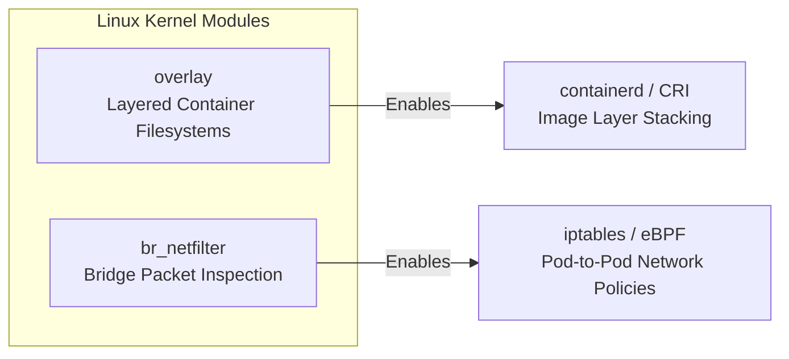
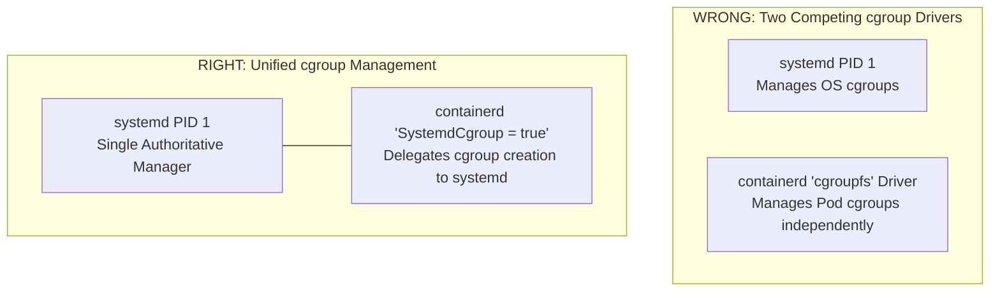
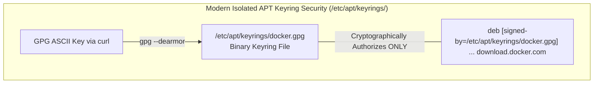

# Step 00: Linux Fundamentals & Kernel Prerequisites for Kubernetes

Before installing Kubernetes or running `kubeadm`, it is essential to understand that **Kubernetes is fundamentally an orchestrator of Linux kernel features**. When you deploy a container or a Pod, Kubernetes does not use "magic"—it configures Linux kernel modules, routing tables, network namespaces, cgroups, and filesystem overlays.

This guide explains the **8 core Linux prerequisites and fundamentals** you must know to build, debug, and understand a Kubernetes cluster on Ubuntu Linux.

---

## 1. Linux Kernel Modules (`overlay` and `br_netfilter`)

Kubernetes relies on specialized Linux kernel modules that are not loaded by default on bare-metal or cloud Ubuntu installations.



### 1.1 The `overlay` Filesystem Module
- **What it is:** The Linux Union/Overlay filesystem (`overlayfs`) combines multiple directory trees (layers) into a single unified filesystem.
- **Why Kubernetes needs it:** Container images are built in layers (a read-only Linux base OS layer, a read-only dependency layer, and a thin read-write container layer on top). The `overlay` kernel module allows `containerd` to stack these layers instantly without copying gigabytes of data on disk for every Pod.
- **Key Linux Commands:**
  ```bash
  # Check if the overlay module is currently loaded in the kernel
  lsmod | grep overlay

  # Manually load the module immediately
  sudo modprobe overlay

  # Ensure it loads automatically on boot
  echo "overlay" | sudo tee -a /etc/modules-load.d/k8s.conf
  ```

### 1.2 The `br_netfilter` Bridge Module
- **What it is:** A Linux bridge operates at Layer 2 (Ethernet). By default, packets crossing a Linux network bridge do not pass through Layer 3/4 firewall rules (`iptables` / `netfilter`).
- **Why Kubernetes needs it:** In Kubernetes, Pods on the same node communicate across a virtual network bridge. Loading `br_netfilter` forces bridged packets to be inspected by Linux firewall rules, allowing Kubernetes Services, kube-proxy, and CNI plugins (like Cilium) to enforce network policies and port forwarding.
- **Key Linux Commands:**
  ```bash
  # Check if br_netfilter is loaded
  lsmod | grep br_netfilter

  # Load the module immediately
  sudo modprobe br_netfilter
  ```

---

## 2. Linux Network Kernel Parameters (`sysctl`)

Even after loading kernel modules, the Linux kernel's default networking behavior is designed for a simple workstation, not a multi-tenant container router. We must tune three kernel parameters using `/etc/sysctl.d/`.

| Kernel Parameter (`sysctl`) | Default | K8s Value | Why Kubernetes Requires It |
| :--- | :---: | :---: | :--- |
| `net.ipv4.ip_forward` | `0` | `1` | **Linux IP Forwarding:** By default, Linux drops any packet that is not destined for its own local IP address. Enabling IP forwarding turns the Linux node into a router so it can forward packets destined for virtual Pod IPs (`10.0.0.0/16`). |
| `net.bridge.bridge-nf-call-iptables` | `0` | `1` | **IPv4 Bridge Filtering:** Instructs the Linux kernel to pass bridged IPv4 traffic through `iptables` chains so Service ClusterIPs and network security policies are evaluated. |
| `net.bridge.bridge-nf-call-ip6tables` | `0` | `1` | **IPv6 Bridge Filtering:** Same as above for IPv6 traffic, preventing security bypasses in dual-stack clusters. |

```bash
# View current sysctl settings
sysctl net.ipv4.ip_forward

# Apply new parameters without rebooting
sudo sysctl --system
```

---

## 3. Control Groups & Process Management (`cgroups` v2 & `systemd`)

### 3.1 What is a cgroup?
A Linux **Control Group (`cgroup`)** is a kernel feature that limits, accounts for, and isolates the CPU, memory, disk I/O, and network usage of a collection of processes. Every Kubernetes Pod CPU limit (`limits.cpu`) and memory limit (`limits.memory`) is implemented directly as a Linux cgroup rule.

### 3.2 Why Driver Consistency (`SystemdCgroup = true`) is Critical
On modern Ubuntu Linux (20.04/22.04/24.04), **`systemd`** is the system initialization process (PID 1) and acts as the primary cgroup manager for the OS.



- **The Problem (`SystemdCgroup = false`):** If `containerd` or `kubelet` is configured to use the default `cgroupfs` driver while Ubuntu uses `systemd`, there are **two independent cgroup managers** fighting over the same system resources. Under high load, this causes resource accounting drift, Out-Of-Memory (OOM) errors, and random Pod evictions.
- **The Solution (`SystemdCgroup = true`):** We explicitly configure `containerd` to delegate all cgroup management to `systemd`, ensuring a single authoritative resource manager.

---

## 4. Linux Memory Management (Why Disable Swap?)

- **What is Swap?** In Linux, swap space is a partition or file on disk used as overflow storage when physical RAM is full. Inactive memory pages are swapped out to slow disk storage.
- **Why Kubernetes requires disabling swap (`swapoff -a`):**
  1. **QoS (Quality of Service) Guarantees:** Kubernetes schedules Pods based on exact physical memory requirements (`Guaranteed`, `Burstable`, `BestEffort`). If Linux swaps container RAM to disk, a Pod that is supposed to be limited to 512 MB could silently consume 2 GB of swap, destroying performance for the entire node.
  2. **Predictable OOM Killing:** When physical RAM is exhausted, Kubernetes expects the Linux kernel OOM killer to immediately terminate offending containers. Swap masks memory leaks and delays evictions.

```bash
# Check if swap is currently active (should show 0)
free -h
swapon --show

# Disable swap immediately for the current session
sudo swapoff -a

# Permanently disable swap across reboots by commenting out fstab swap entries
sudo sed -i '/ swap / s/^\(.*\)$/#\1/g' /etc/fstab
```

---

## 5. Linux Networking: Routing Tables & Policy-Based Routing

When running Kubernetes on cloud platforms (OpenStack, AWS, GCP), VMs often have multiple network interfaces or receive external Floating IPs (Public IPs).

### 5.1 Standard Linux Routing Table vs. Policy-Based Routing
- **Standard Routing (`ip route`):** Linux typically uses a single main routing table (`table 254`). Outgoing packets are evaluated against destination IP prefixes and sent out the default gateway.
- **Policy-Based Routing (`ip rule` / Netplan):** Allows Linux to select different routing tables based on the **source IP address** of the outgoing packet.

### 5.2 Why Asymmetric Routing Happens on Cloud Load Balancers
In **Step 02**, our HAProxy VM (`loadbalancer`) is attached to both an internal network and an external load balancer subnet (`enp4s0`) with a Floating IP.

```text
External Internet Request ---> [Door A: enp4s0 (10.0.50.10)] ---> HAProxy VM
                                                                    |
External Internet Reply   <--- [Door B: Default Gateway]    <-------+ (DROPPED!)
```

1. An external user sends an HTTP request to your Floating IP. It arrives on interface `enp4s0`.
2. When HAProxy generates the response packet, Linux checks the main routing table and tries to send the response out the VM's primary internal default gateway.
3. The upstream router drops the packet because it entered via Door A (`enp4s0`) but exited via Door B (asymmetric routing).

**The Solution (`table: 102` in Netplan):**
We configure Linux Policy Routing so that **any packet whose source address is `enp4s0`'s IP is forced to use routing table 102**, routing it back out through `enp4s0`'s OpenStack gateway (`10.0.50.1`).

```bash
# View Linux routing rules and which table they point to
ip rule show

# View routes inside custom routing table 102
ip route show table 102
```

---

## 6. Cloud Link-Local Metadata (`169.254.169.254`)

- **What it is:** On cloud providers (OpenStack, AWS, Azure, GCP), the IP address `169.254.169.254` is a **Link-Local Metadata HTTP Service** provided by the hypervisor.
- **Why we use it in Kubernetes:** When a Linux VM boots from an image, it needs to discover its own cloud identity, assigned hostname, SSH keys, and network IP addresses without hardcoding.
- **Why we synchronize hostnames:** In **Step 01**, we run `curl -s http://169.254.169.254/latest/meta-data/hostname` to set the Ubuntu OS hostname (`hostnamectl set-hostname`). This guarantees that Kubernetes TLS certificates and OpenStack cloud controller names match exactly.

```bash
# Query OpenStack instance metadata directly from the VM
curl -s http://169.254.169.254/latest/meta-data/hostname
```

---

## 7. Linux Package Manager Locks (`apt` / `dpkg` / `cloud-init`)

- **What happens on boot:** When Ubuntu boots in a cloud environment, background systemd services like **`cloud-init`** and **`unattended-upgrades`** automatically run to update security packages and apply cloud ssh keys.
- **Why scripts fail:** While running, these background processes hold exclusive file locks on `/var/lib/dpkg/lock-frontend` and `/var/lib/apt/lists/lock`.
- **The Best Practice:** Before executing `apt-get install` commands in automated scripts or manual setup, always wait for cloud-init and dpkg locks to release:

```bash
# Wait for OpenStack cloud-init to finish boot scripts
cloud-init status --wait

# Safely check if any background process is holding dpkg/apt locks
while fuser /var/lib/dpkg/lock >/dev/null 2>&1 || \
      fuser /var/lib/dpkg/lock-frontend >/dev/null 2>&1 || \
      fuser /var/lib/apt/lists/lock >/dev/null 2>&1; do
  echo "Waiting for apt/dpkg locks to release..."
  sleep 5
done
```

---

## 8. Linux Package Repository Security: GPG Keyrings & Version Pinning

In **Step 01**, we configure third-party software repositories for Docker (`containerd.io`) and Kubernetes (`pkgs.k8s.io`). Why don't we just run `apt install containerd kubelet` directly from Ubuntu's default archives?



### 8.1 Why Dedicated Keyrings (`/etc/apt/keyrings/`) instead of `apt-key`?
- **The Old (Deprecated) Way (`apt-key add`):** Historically, administrators added third-party GPG keys to `/etc/apt/trusted.gpg`. This was deprecated because any key in `trusted.gpg` became a global root of trust—a compromised third-party key could sign fake system packages for `archive.ubuntu.com`.
- **The Modern Linux Security Standard (`/etc/apt/keyrings/`):**
  1. `mkdir -p /etc/apt/keyrings`: Creates an isolated directory for repository-specific public keys.
  2. `gpg --dearmor`: Converts ASCII-armored PGP keys (`.asc` or text-formatted `.gpg`) downloaded via `curl` into standard binary OpenPGP keyring format required by APT.
  3. `[signed-by=/etc/apt/keyrings/docker.gpg]`: Inside `/etc/apt/sources.list.d/docker.list`, we explicitly restrict trust. APT will **only** accept packages from `download.docker.com` if they are cryptographically signed by the exact binary key in `/etc/apt/keyrings/docker.gpg`.

```bash
# 1. Create the isolated keyring directory
sudo mkdir -p /etc/apt/keyrings

# 2. Download and dearmor (convert ASCII to binary OpenPGP format)
curl -fsSL https://download.docker.com/linux/ubuntu/gpg | sudo gpg --dearmor -o /etc/apt/keyrings/docker.gpg

# 3. Add source entry explicitly scoped to that keyring
echo \
  "deb [arch=$(dpkg --print-architecture) signed-by=/etc/apt/keyrings/docker.gpg] https://download.docker.com/linux/ubuntu \
  $(lsb_release -cs) stable" | sudo tee /etc/apt/sources.list.d/docker.list
```

### 8.2 Why We Lock Package Versions (`apt-mark hold`)
In Linux, background unattended updates (`unattended-upgrades`) or standard `sudo apt upgrade` commands will automatically upgrade any package to its newest release.

- **Why Kubernetes requires holding versions:** Upgrading a Kubernetes node's `kubelet` or `kubeadm` to a newer minor version before upgrading the control plane violates Kubernetes Version Skew Compatibility rules and can cause cluster outages.
- **The Linux Command:**
  ```bash
  # Prevent APT from automatically upgrading Kubernetes packages
  sudo apt-mark hold kubelet kubeadm kubectl

  # To check which packages are currently held on a Linux node
  apt-mark showhold
  ```

---

### [Next Step: Step 01 - Common Node Preparation &rarr;](01-common-node-setup.md)

