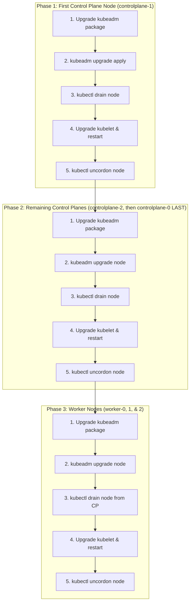

# Step 07: Zero-Downtime HA Cluster Rolling Upgrade (`kubeadm upgrade`)

This guide explains the Kubernetes High Availability (HA) rolling upgrade architecture and walks you through upgrading your 6-node Kubernetes cluster manually from one patch or minor version to another with **zero application downtime**.



---

## 🔌 Before You Begin: Core Architectural Rules

1. **Why Upgrade `controlplane-0` LAST?**
   > [!IMPORTANT]
   > In our workshop architecture, `controlplane-0`'s internal IP address is used directly as the API server endpoint in your `kubeconfig` and for worker node connections.
   > Upstream Kubernetes allows **any** HA control plane node to be the first node upgraded (`kubeadm upgrade apply`). By running `kubeadm upgrade apply` on `controlplane-1` first, and upgrading `controlplane-0` **last**, your primary API endpoint (`controlplane-0`) remains completely stable and undisturbed until the rest of the control plane is already upgraded and healthy!

2. **Minor Version Upgrades Require APT Repository Update (`v1.35` &rarr; `v1.36`):**
   - The official Linux community repository (`pkgs.k8s.io`) is scoped by **minor release** (`/v1.35/`, `/v1.36/`).
   - If you check `apt-cache madison kubeadm` and only see `1.35.*` versions, it is because `/etc/apt/sources.list.d/kubernetes.list` is currently pointed at `/v1.35/deb`.
   - To upgrade across minor releases (e.g., to Kubernetes **v1.36**), you must update `/etc/apt/sources.list.d/kubernetes.list` on each node to point to `https://pkgs.k8s.io/core:/stable:/v1.36/deb/ /` before running `apt-get update`.

3. **`kubeadm upgrade apply` vs. `kubeadm upgrade node`:**
   - **`kubeadm upgrade apply <version>`** is executed **ONLY ONCE** on the first control plane node (`controlplane-1`). This upgrades the cluster-wide etcd schemas, API ConfigMaps, and core control-plane static Pods (`kube-apiserver`, `kube-controller-manager`, `kube-scheduler`).
   - **`kubeadm upgrade node`** is executed on **all other nodes** (`controlplane-2`, `controlplane-0`, and all worker nodes). It updates local node manifests without attempting to re-upgrade cluster-wide state.

4. **Strict Component Order on Each Node:**
   - Always upgrade **`kubeadm`** first.
   - Run the `kubeadm upgrade` command (`apply` or `node`).
   - Drain the node (`kubectl drain`).
   - Upgrade **`kubelet` and `kubectl`**, then restart the `kubelet` systemd service.
   - Uncordon the node (`kubectl uncordon`).

5. **Version Skew Compatibility Rules:**
   - Control plane nodes can be upgraded one minor version at a time (e.g., `v1.35.x` &rarr; `v1.36.x`) or across patch versions (e.g., `v1.35.7` &rarr; `v1.35.8`).
   - Worker `kubelet` versions can be up to **3 minor versions older** than `kube-apiserver`, meaning your applications keep running on workers while you upgrade the control plane.

---

## 0. Choose Your Target Kubernetes Version & Update APT Repository

- **What this step does:** Explains how to switch your APT repository source when upgrading across minor releases (e.g., `v1.35` &rarr; `v1.36`) and checks available package versions in the official `pkgs.k8s.io` repository.
- **Why we are doing it:** Without updating `/etc/apt/sources.list.d/kubernetes.list`, APT will only see packages for your currently configured minor release.

Run this on **any control plane node**:

```bash
# 1. If upgrading across minor versions (e.g., v1.35 -> v1.36), update your APT repository:
export TARGET_MINOR_VERSION="v1.36"
```
```bash
echo "deb [signed-by=/etc/apt/keyrings/kubernetes-apt-keyring.gpg] https://pkgs.k8s.io/core:/stable:/${TARGET_MINOR_VERSION}/deb/ /" | sudo tee /etc/apt/sources.list.d/kubernetes.list
```
```bash
# 2. Update package lists and check available versions:
sudo apt-get update
apt-cache madison kubeadm
```

In the commands below, we will use an environment variable `TARGET_VERSION`. Replace `1.36.0-1.1` (or your target patch version) with the exact version string you see from `apt-cache madison`:

```bash
# Set your desired target package version (e.g., 1.36.0-1.1 or 1.35.8-1.1)
export TARGET_VERSION="1.36.0-1.1"
export KUBE_VERSION=$(echo "${TARGET_VERSION}" | cut -d'-' -f1)
echo "Upgrading cluster to Kubernetes v${KUBE_VERSION}"
```

---

## 1. Upgrade the First Control Plane Node (`controlplane-1`)

- **What this step does:** Upgrades `controlplane-1` as the primary upgrade leader using `kubeadm upgrade apply`.
- **Why we are doing it:** Upgrading `controlplane-1` first updates the shared `etcd` database schemas and upgrades the API server across the cluster while keeping `controlplane-0` (your default `kubeconfig` endpoint) stable.

SSH into **`controlplane-1`** and run:

```bash
# 1. Export the target versions on this node
export TARGET_MINOR_VERSION="v1.36"
export TARGET_VERSION="1.36.0-1.1"
export KUBE_VERSION=$(echo "${TARGET_VERSION}" | cut -d'-' -f1)
```
```bash
# 2. Update APT repository source for the target minor version
echo "deb [signed-by=/etc/apt/keyrings/kubernetes-apt-keyring.gpg] https://pkgs.k8s.io/core:/stable:/${TARGET_MINOR_VERSION}/deb/ /" | sudo tee /etc/apt/sources.list.d/kubernetes.list
```
```bash
# 3. Unhold and upgrade kubeadm
sudo apt-mark unhold kubeadm
sudo apt-get update && sudo apt-get install -y kubeadm=${TARGET_VERSION}*
sudo apt-mark hold kubeadm
```
```bash
# 4. Verify that kubeadm is upgraded
kubeadm version
```
```bash
# 5. Check the upgrade plan (validates cluster health and component versions)
sudo kubeadm upgrade plan
```
```bash
# 6. Apply the control plane upgrade (ONLY run on this first control plane node!)
sudo kubeadm upgrade apply v${KUBE_VERSION} --yes
```
```bash
# 7. Drain the node to safely reschedule any non-control-plane pods
kubectl drain controlplane-1 --ignore-daemonsets
```
```bash
# 8. Unhold and upgrade kubelet and kubectl
sudo apt-mark unhold kubelet kubectl
sudo apt-get install -y kubelet=${TARGET_VERSION}* kubectl=${TARGET_VERSION}*
sudo apt-mark hold kubelet kubectl
```
```bash
# 9. Reload systemd and restart kubelet
sudo systemctl daemon-reload
sudo systemctl restart kubelet
```
```bash
# 10. Uncordon the node to allow Pods to be scheduled again
kubectl uncordon controlplane-1
```

---

## 2. Upgrade Remaining Control Planes (`controlplane-2`, then `controlplane-0` LAST)

- **What this step does:** Upgrades the remaining High Availability control plane nodes one at a time using `kubeadm upgrade node`, finishing with `controlplane-0`.
- **Why we are doing it:** Secondary control plane nodes join an already-upgraded `etcd` and API schema; `kubeadm upgrade node` synchronizes their local static Pod manifests and TLS certificates without re-running global cluster migrations.

Repeat these commands **first on `controlplane-2`**, and **finally on `controlplane-0`**:

```bash
# 1. Export target versions on this node
export TARGET_MINOR_VERSION="v1.36"
export TARGET_VERSION="1.36.0-1.1"
```
```bash
# 2. Update APT repository source for the target minor version
echo "deb [signed-by=/etc/apt/keyrings/kubernetes-apt-keyring.gpg] https://pkgs.k8s.io/core:/stable:/${TARGET_MINOR_VERSION}/deb/ /" | sudo tee /etc/apt/sources.list.d/kubernetes.list
```
```bash
# 3. Unhold and upgrade kubeadm
sudo apt-mark unhold kubeadm
sudo apt-get update && sudo apt-get install -y kubeadm=${TARGET_VERSION}*
sudo apt-mark hold kubeadm
```
```bash
# 4. Upgrade local control plane node configuration (NOTE: use 'node', NOT 'apply'!)
sudo kubeadm upgrade node
```
```bash
# 5. Drain this node from workloads
kubectl drain $(hostname) --ignore-daemonsets

# 6. Unhold and upgrade kubelet and kubectl
sudo apt-mark unhold kubelet kubectl
sudo apt-get install -y kubelet=${TARGET_VERSION}* kubectl=${TARGET_VERSION}*
sudo apt-mark hold kubelet kubectl
```
```bash
# 7. Reload systemd and restart kubelet
sudo systemctl daemon-reload
sudo systemctl restart kubelet
```
```bash
# 8. Uncordon the node
kubectl uncordon $(hostname)
```

---

## 3. Upgrade Worker Nodes (`worker-0`, `worker-1`, `worker-2`)

- **What this step does:** Upgrades worker nodes one by one while keeping application workloads running on the remaining worker nodes.
- **Why we are doing it:** Draining a worker node (`--delete-emptydir-data`) safely evicts Pods so Kubernetes can reschedule them onto other healthy workers before `kubelet` restarts.

Repeat this 3-step sequence **one node at a time** for `worker-0`, `worker-1`, and `worker-2`:

### Step 3.1: Drain the Worker Node (from your workstation or `controlplane-0`)
```bash
# Execute from your local machine (via kubeconfig) or controlplane-0:
kubectl drain worker-0 --ignore-daemonsets --delete-emptydir-data
```

### Step 3.2: Upgrade Packages on the Worker Node
SSH into **`worker-0`** and run:

```bash
export TARGET_MINOR_VERSION="v1.36"
export TARGET_VERSION="1.36.0-1.1"
```
```bash
# 1. Update APT repository source for the target minor version
echo "deb [signed-by=/etc/apt/keyrings/kubernetes-apt-keyring.gpg] https://pkgs.k8s.io/core:/stable:/${TARGET_MINOR_VERSION}/deb/ /" | sudo tee /etc/apt/sources.list.d/kubernetes.list
```
```bash
# 2. Unhold and upgrade kubeadm
sudo apt-mark unhold kubeadm
sudo apt-get update && sudo apt-get install -y kubeadm=${TARGET_VERSION}*
sudo apt-mark hold kubeadm
```
```bash
# 3. Upgrade local worker node configuration
sudo kubeadm upgrade node
```
```bash
# 4. Unhold and upgrade kubelet and kubectl
sudo apt-mark unhold kubelet kubectl
sudo apt-get install -y kubelet=${TARGET_VERSION}* kubectl=${TARGET_VERSION}*
sudo apt-mark hold kubelet kubectl
```
```bash
# 5. Reload systemd and restart kubelet
sudo systemctl daemon-reload
sudo systemctl restart kubelet
```

### Step 3.3: Uncordon the Worker Node (from your workstation or `controlplane-0`)
```bash
# Execute from your local machine (via kubeconfig) or controlplane-0:
kubectl uncordon worker-0
```

*(Repeat Section 3 for `worker-1` and `worker-2`)*.

---

## 4. ✅ Verification Check

- **What this check does:** Validates that all 6 cluster nodes have successfully transitioned to the new Kubernetes version and are in the `Ready` state.
- **Why we are doing it:** Confirms that `kubelet`, `containerd`, Cilium CNI, and the HA control plane are running smoothly after the upgrade.

```bash
# 1. Check all nodes (should show Ready and the new VERSION)
kubectl get nodes -o wide

# 2. Verify core control-plane pods are healthy
kubectl get pods -n kube-system

# 3. Verify Cilium eBPF CNI status
cilium status
```

---

* **[&larr; Back to Documentation Overview](README.md)**
* **[&larr; Back to Step 06: Verification & Troubleshooting](06-verification-and-troubleshooting.md)**
