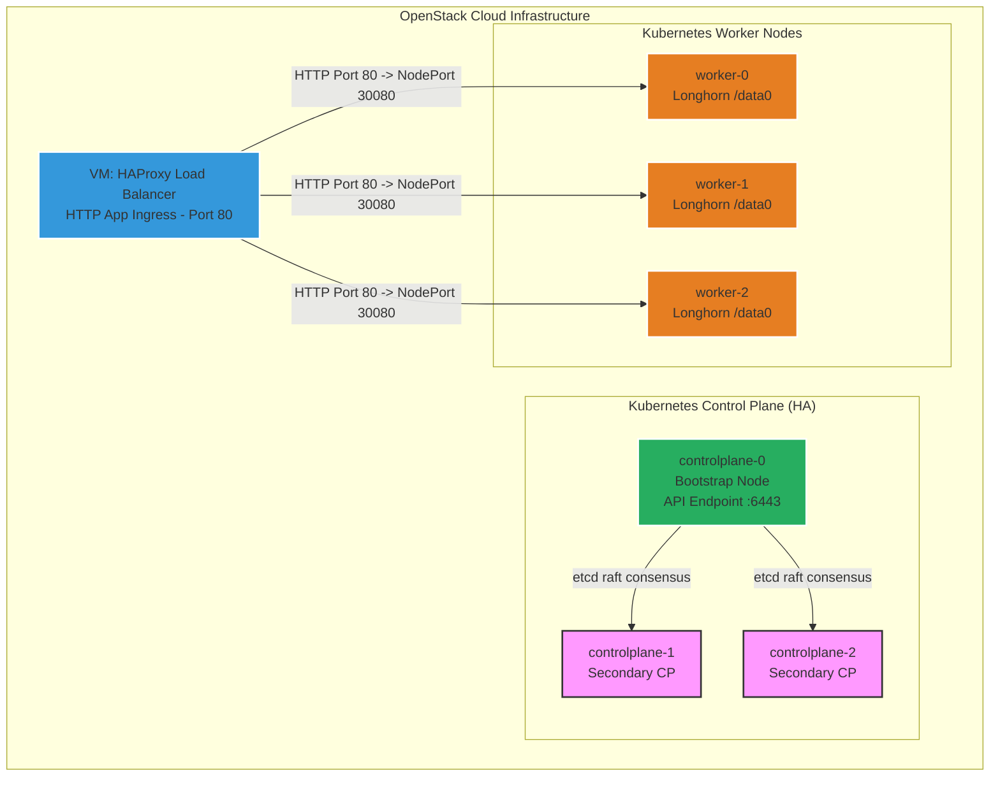

# Manual Kubernetes Cluster Setup Guide (Learning Tutorial)

Welcome to the manual deployment guide for the **High Availability (HA) Kubernetes Cluster on OpenStack**! 

While the project provides automated Ansible playbooks (`ansible/`) to configure the cluster in minutes, building a Kubernetes cluster **by hand** is the best way to understand the underlying mechanics of Linux kernel modules, container runtimes (`containerd`), `kubeadm` cluster bootstrapping, CNI networking (**Cilium**), and the **Gateway API**.

This documentation translates every automated step from the Ansible playbooks into clear Linux and Kubernetes CLI commands. Every section explicitly explains:
- **What this step does:** What the Linux, container runtime, or Kubernetes CLI command executes under the hood.
- **Why we are doing it:** The architectural, networking, or Kubernetes-specific reason why this configuration is required for an OpenStack HA cluster.

---

## 🏛️ Cluster Architecture & Node Inventory

The cluster consists of **7 Ubuntu 24.04 LTS Virtual Machines**:



| Component | Type / Count | Identifier Pattern | Core Responsibility |
| :--- | :---: | :--- | :--- |
| **KubeAPI Endpoint** | controlplane-0 IP | `controlplane-0` | The Kubernetes API (`port 6443`) is accessed directly via `controlplane-0`'s internal IP address. All nodes and `kubectl` clients connect to this IP. |
| **HTTP Load Balancer VM** | Ubuntu VM (1) | `loadbalancer` (`haproxy_lb`) | Dedicated HAProxy ingress VM with Floating IP that routes incoming HTTP application traffic (`port 80`) to worker NodePort `30080`. |
| **Control Plane Nodes** | Ubuntu VMs (3) | `controlplane-0...2` | High Availability Kubernetes Control Plane (`kube-apiserver`, `etcd`, `kube-scheduler`, `kube-controller-manager`). |
| **Worker Nodes** | Ubuntu VMs (3) | `worker-0...2` | Application workload execution, Cilium CNI, and Longhorn distributed storage (`/data0`). |

---

## 📋 Prerequisites

Before starting the manual setup:
1. **VM Provisioning**: Ensure you have run Terraform (`cd initInfra && terraform apply`) so that all 7 OpenStack VMs are powered on and reachable via SSH.
2. **SSH Access**: You should be able to SSH into any VM as the `ubuntu` user using your private key:
   ```bash
   ssh -i secrets/private_key.pem ubuntu@<VM_IP>
   ```
3. **Root Privileges**: Most commands require elevated privileges. Prefix commands with `sudo` or start an interactive root shell using `sudo -i`.

---

## 🚀 How to Continue After `terraform apply` (Bridging Infra to Manual K8s)

When `terraform apply` finishes in `initInfra/`, your 7 VMs are booted, but **no Kubernetes software is installed yet**. 

Here is exactly how to start manual cluster assembly:

### 1. Locate Your VM IP Addresses and Control Plane Endpoint
Terraform automatically generates the Ansible inventory files in `ansible/` containing the exact IP addresses of every VM. Check your VM IP addresses anytime from the project root:

```bash
# View all 7 VM names and their private IP addresses
cat ansible/inventory_all.ini
```

The `control_plane_endpoint` in the inventory points directly to **controlplane-0's IP address**. This is the IP that all nodes and `kubectl` clients use to reach the Kubernetes API on port `6443`.

### 2. Connect to Your Nodes via SSH
For each guide in the roadmap below, open a terminal (or multiple tabs/panes) and SSH into the target VM from your project root:

```bash
ssh -i secrets/private_key.pem ubuntu@<VM_IP_ADDRESS>
```

### 3. What to Do If You Make a Mistake
You **do not** need to re-run `terraform destroy` or `terraform apply` if you make a mistake on a Kubernetes node! You can reset any node to a clean state by running:

```bash
# On the node you want to reset:
sudo kubeadm reset -f
sudo rm -rf /etc/kubernetes/admin.conf /etc/kubernetes/pki $HOME/.kube/config
```

---

## 🗺️ Step-by-Step Learning Roadmap

Follow these guides in numerical order to build your cluster from scratch:

| Step | Guide | Ansible Playbook | Target Nodes | What You Learn |
| :---: | :--- | :--- | :--- | :--- |
| **00** | **[Linux Fundamentals & Prerequisites](00-linux-prerequisites-for-kubernetes.md)** | *(Conceptual & Prerequisite)* | **All Nodes** | Understanding the 7 core Linux kernel prerequisites (`overlay`, `br_netfilter`), IP forwarding sysctls, cgroups (`SystemdCgroup`), swap memory management, Policy-Based Routing, and OpenStack Metadata (`169.254.169.254`). |
| **01** | **[Common Node Preparation](01-common-node-setup.md)** | `playbook_common.yaml` | **All 6 K8s Nodes**<br/>(CP 0–2, Worker 0–2) | Hostname synchronization via OpenStack Metadata API, swap disabling, kernel modules (`overlay`, `br_netfilter`), sysctl tuning, `containerd`, and installing `kubeadm`, `kubelet`, `kubectl`. |
| **02** | **[Load Balancer Setup](02-load-balancer-setup.md)** | `playbook_lb.yaml` | **Load Balancer VM** | Installing HAProxy, configuring round-robin backend health checks, and OpenStack floating IP asymmetric policy routing via Netplan. |
| **03** | **[Control Plane Bootstrap](03-controlplane-init.md)** | `playbook_controlplane_init.yaml` | **controlplane-0**<br/>(Primary CP) | Initializing Kubernetes v1.35 without `kube-proxy`, setting up administrator `kubeconfig`, installing Helm, **Gateway API v1.6.1**, **Cilium CNI**, and Metrics Server. |
| **04** | **[Joining Additional Control Planes](04-controlplane-join.md)** | `playbook_controlplane_join.yaml` | **controlplane-1 & 2**<br/>(Secondary CP) | Re-uploading TLS certificates, generating `kubeadm` join tokens, and forming an HA `etcd` and API control plane. |
| **05** | **[Joining Worker Nodes](05-worker-join.md)** | `playbook_worker_join.yaml` | **worker-0, 1, 2** | Preparing Longhorn storage directories (`/data0`) and joining worker nodes to execute workloads. |
| **06** | **[Verification & Troubleshooting](06-verification-and-troubleshooting.md)** | *(Manual Verification)* | **Any Node / Local** | Validating cluster readiness, debugging Cilium/Hubble connectivity, testing Gateway API Ingress, and resolving IP mismatch errors. |
| **07** | **[HA Cluster Rolling Upgrade](07-ha-cluster-upgrade.md)** | `playbook_controlplane_upgrade.yaml`<br/>`playbook_worker_upgrade.yaml` | **All 6 K8s Nodes** | Performing zero-downtime rolling upgrades across an HA cluster (`kubeadm upgrade apply` vs `node`, draining/uncordoning nodes, and version skew compatibility). |

---

> [!TIP]
> **Ready to begin?** Start with **[Step 00: Linux Fundamentals & Prerequisites](00-linux-prerequisites-for-kubernetes.md)** to master the Linux kernel concepts behind Kubernetes, or jump directly to **[Step 01: Common Node Preparation](01-common-node-setup.md)** to start hands-on execution.
